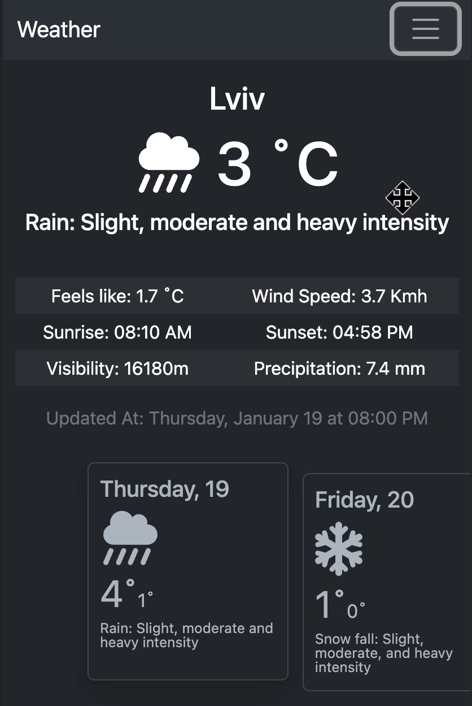

# Weather App

This is a React.ts application that provides all the basic functionality you expect from a weather app
[Demo](https://weather-f4087.web.app/)


# Installation

To start the app simply run those commands

```
npm i
npm run dev
```

<mark>KEEP IN MIND</mark> </br>
You should create `.env` file with `VITE_APP_GOOGLE_API_KEY=` line, containing your Google API key for the Google Autoplaces API to work
(If you don't posses one, just leave some random string there, but the feature of getting location by click of a button won't work)

# Features

- Work offline with the last request cached in memory and can be installed on mobile devices (PWA support)
- Two languages available (additional languages could be added quite easily)
- Dark Mode
- Changeable units of measurement
- Timezone is adjusted automatically

# Tests

Any new added functionality should be tested properly. To run tests, run the following commands

```
npm run test
```

# Projects aims

This is a study project, created to polish off the React skills as well as to learn new concepts such as React Testing Library, [PWA](https://web.dev/what-are-pwas/#capable "Progressive Web App, that can run natively on mobile devices"), work with external libraries and APIs and much more! But the main goal was to create a weather app that could be used on a daily basis.

# Example of use

## Home page


At starting page you are presented with a default weather prediction for my favorite city - Lviv.

## Unit of measurement
 </br>
[Open Meteo](open-meteo.com) allows you to chose units for the weather prediction

## Mobile Response

 </br>
During the development process mobile responsivness was kept in mind all along. The main purpose of app was to provide great user experience from mobile devices

# Technologies

- React v18
- React Testing Library, Vitest
- Typescript
- Bootstrap v5.3
- Google Places API
- Font Awesome
- VitePWA

# Sources

Those sources gave a gread deal of inspiration while developing

- [Google Places API](https://developers.google.com/maps/documentation/places/web-service/overview)
- [Open Meteo](https://open-meteo.com)
- [Font Awesome](https://fontawesome.com)
